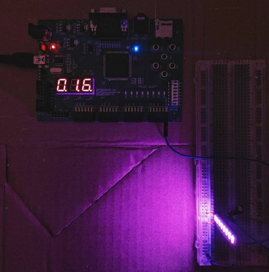
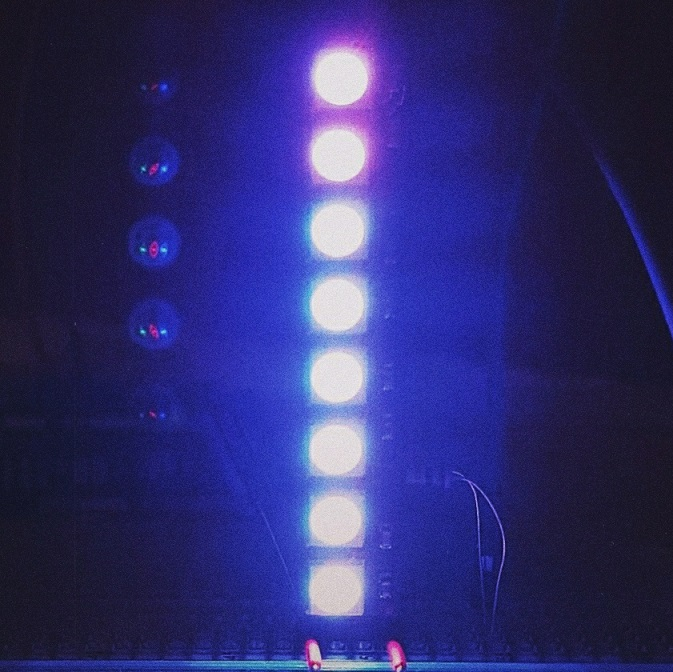
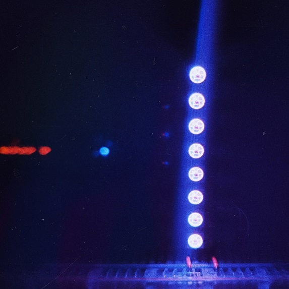

# WS2812 LED RGB Controller
This is a project of a controller for WS2812 eight led stripe, written in VHDL and implemented on Elbert V2 (with Spartan 3A) development board.

It was created as a student project for "Projektowanie Systemów Cyfrowych w Językach Opisu Sprzętu" course. 

Author: Karolina Rapacz

Every diode of WS2812 is driven by 24-bit signal where every eight bit represents value of RGB component. According to the led documentation 0 and 1 of mentioned signal have to be represented by sequences of high and low state (kind of pulses) with defined duration time. Lightning up another diode requires sending low state signal with duration at least 50 us, which additionaly let control of moment of turning up diode. 

In this solution, led stripe can work in two modes - sequential and user defined. Pulses generation starts after switching on and off RESET DIP switch.

### LED_SEQ.vhd

In the sequential mode the following diodes are lightened in one color - pink or blue-violet and when the stripe is fully covered with a one color, from the bottom to the top diodes one by one are changing their color to the second. The procedure are repeated in the loop, until user will change the mode.

### LED_RGB_SPART.vhd

In the user defined mode, all eight diodes are lightened in the same time. The light's color is set by user and it consists of RGB components. The value of every component is set by user with usage of push buttons. They are buttons responsible for adding or subtracting one, ten or hundred from single, chosen RGB component value which is shown on a seven segment displays.

